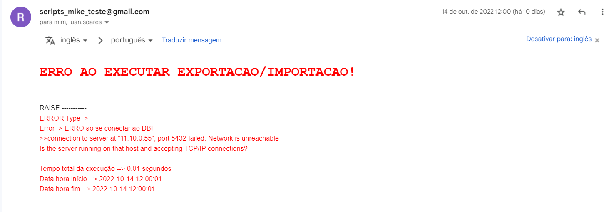

## Objetivo
Criar um programa robusto, escalável, eficiente e eficaz com paradigma de orientação a objetos  que faz a transferência em massa de tabelas completas de um banco de dados alocado em um servidor para um banco de dados alocado localmente, é necessário o envio de e-mail com status de execução do programa e salvamento de log com status de transferência de cada tabela.

## Fontes de estudos 
Artigo Exportação - [Melhores maneiras e etapas para exportar dados Postgres para CSV](https://hevodata.com/learn/postgres-export-to-csv/#:~:text=The%20easiest%20but%20the%20most,with%20the%20COPY%20TO%20command.)<br>
Artigo Importação - [Encontrar o melhor método para importar dados CSV em massa para o PostgreSQL](https://medium.com/analytics-vidhya/part-4-pandas-dataframe-to-postgresql-using-python-8ffdb0323c09).

## Solução proposta
<b>Stacks:</b> 
Python: (Classe main: [time, datetime], Claas email__class: [MIMEMultipart, MIMEText, smtplib, ABC, abstractclassmethod], Classe dataWriter_class: [os, datetime], Classe database_class: [List, psycopg2, time])
Postgres: PSQL

<b>Arquitetura:</b> 
Em quesito de robustez, escalabilidade e eficiência do programa, foi utilizado a linguagem de programa Python com orientação a objetos e PSQL.

- Classe main: responsável pela orquestração de execução do programa.
- Classe email_class: responsável pelo envio de e-mail com status de execução.
- Classe dataWriter_class: responsável por salvar log de execução tabela a tabela exportada e importada.
- Classe database_class: responsável por realizar todas operações que envolva banco de dados.

Funcionamento do programa:
Uma vez configurado as conexões com os bancos de dados na classe <b>Db</b> do script <b>database_class</b>, o programa irá funcionar de forma prática e encapsulada, no script <b>main.py</b> é somente necessário definir a instanciação de um objeto <b>database</b>, com o objeto do tipo database é necessário chamar em sequência os métodos <b>psql_export</b> e <b>psql_import</b>, nos dois casos deve ser passado como parâmetro o <b>schema.tabala</b> a ser exportado/importado e o nome do arquivo <b>.csv</b> onde será exportado os dados e posteriormente utilizado para importação de dados. 

Exemplo de uso dos métodos de importação e exportação:
```
database.psql_export('select * from sales.stores_sales', 'sales_stores_sales.csv') #Tabela a ser exportada / arquivo csv de salvamento de dados
database.psql_import('sales.stores_sales','sales_stores_sales.csv') #Tabelas a ser importado os dados / arquivo que contem os dados
```

## Resultados
<b>Problemas resolvidos:</b> Inicial sem um estudo da situação, o programa foi confeccionado utilizando a biblioteca pandas, era iniciada a exportação dos dados com a execução de um "select" no banco de dados, com os dados em memória convertidos para um "dataframe" era feita a importação dos dados via o comando "to_sql". No entanto, essa solução não se mostrou eficiente e nem eficaz quando se tratava da exportação/importação de uma abundância dados, além do processo ser lento, em alguns casos acontecia a quebra de uso da memória ram, assim interrompendo a execução do programa. Com essas circunstancias foi feito uma busca para se encontrar os melhores método para Exportação e Importação de dados, nos artigos de estudo é possível concluir que uma das melhores técnicas para se realizar essa tarefa é com comandos PSQL, dessa forma o programa foi adaptado para funcionar junto a comandos PSQL, com o ajuste foi possível constatar o perfeito funcionamento do programa de forma rápida com eficiente e eficacia.


<b>Resultado final:</b>
O Programa finalizado com sucesso e se mostrou eficiente e eficaz, aplicado uma das melhores técnicas de exportação e importação de dados, é de fácil utilização, fácil manutenção, escalável e robusto.

<p align="center">
  <b>E-mail com status de execução bem-sucedido</b>
  
</p>

<p align="center">
  <b>E-mail com status de execução mal sucedido</b>
  
</p>

<p align="center">
  <b>Mensagem no arquivo de Log</b>
  
</p>
